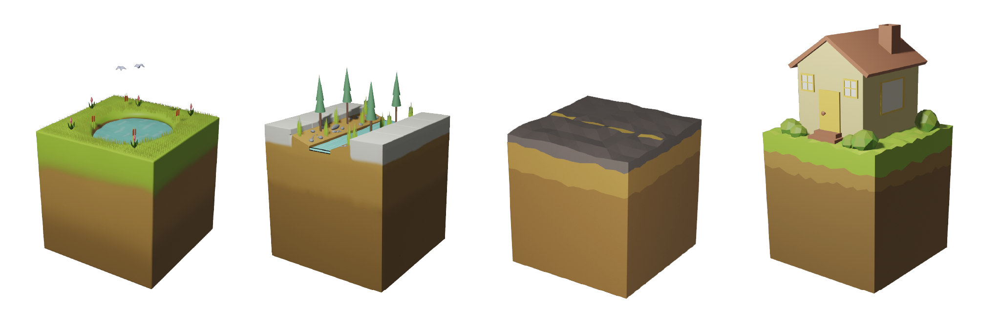

[Home](./)      /       [Meet The Team](./team.html)        /       [Archive](./archive.html)

# Archive

This page contains an archive of images, documents, and diagrams that are relevant to the progression of our project throughout the year. 

## Script Interaction Diagram

##### Figure 1: Diagram of how all the C# scripts interact for game functionality.

## Tile Design Iteration

##### Figure 2: Initial concept art for the game tiles. Created in Illustrator.

##### Figure 3: Cubemap textures made for the first attempt at creating 3D tiles. Created in Illustrator.

##### Figure 4: Final 3D tile designs. Sculpted and rendered in Blender.

## Skybox Design

##### Figure 5: Skybox cubemap texture created to surround the game's playable area. Created in Illustrator.

