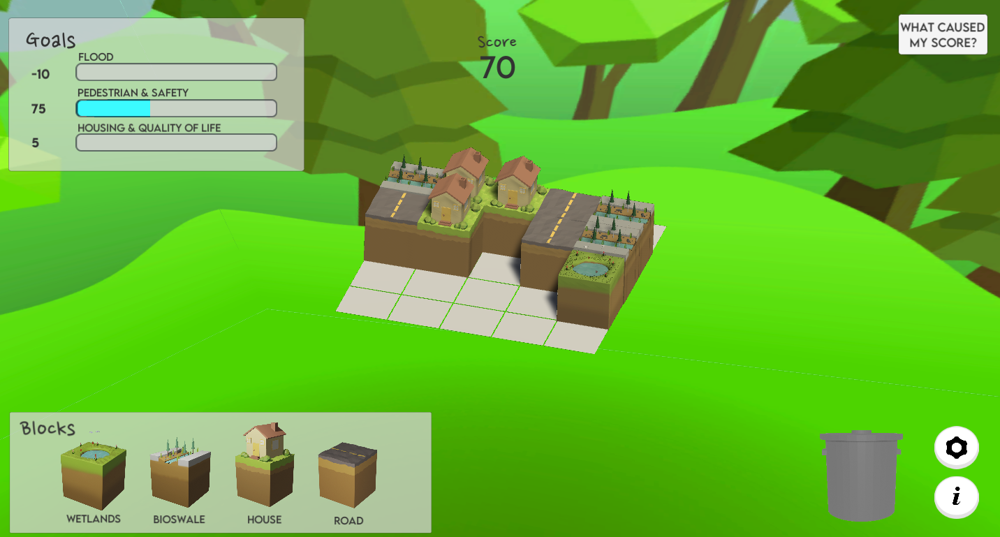

[Home](./)      /       [Meet The Team](./team.html)        /       [Archive](./archive.html)

# Home

##### Figure 1: Screenshot of the game UI.

## Overview

For our 2020-2021 capstone project, we have developed educational game for mobile platforms, intended to help young children learn about the interactions and components within a neighborhood. The user has access to four tiles- house, road, bioswale, and wetlands, and can arrange them on a 5 by 5 neighborhood grid to raise and lower scores in three benchmarks- flood management, pedestrian safety, and housing / quality of life.

Our project partner is Fatima Taha, a Geography PHD candidate at Oregon State. Her studies focus on bioswales, which are channels between the road and sidewalk which redirect rainwater runoff and harbor vegetation and trees. Taha's goal for this project is to allow users to learn about the components of the neighborhood and their interactions by playing the game, then assess their knowledge of bioswales through a survey after completing the game.

The game is developed using Unity as the game engine. The game scripts are written in C#, and are used to control the mechanics of the game, such as dragging tiles, rotating the screen, and calculating score. The UI is created through Unity's UI features, the skybox is designed in Adobe Illustrator, and the tile assets are sculpted in Blender.

## Purpose

Build Your Neighborhood is designed to teach its players about how a neighborhood is put together, focused mainly around the importance of bioswales. It is not a city building simulator. Instead, it is a more abstract representation of how different components in a neighborhood interact with eachother and affect the community. The player places four different types of blocks onto a 5x5 grid to build a quality neighborhood. For every block placed next to others on the grid, the user receives feedback on the action through score changes for three different metrics, as well as a short description for each metric's change. This way, the player learns about the positive and negative effects of the interoperabilities of the components of a neighborhood. 

For example, a player can place a bioswale block next to a house block. When this interaction occurs, the pedestrian safety score increases by 30 points because a new socialization area is created. The flood safety score increases by 50 points because of drainage effect of the bioswale. Finally, the quality of life score decreases by 30 points because of the maintenance that nearby homeowners would expect the bioswale to have. The feedback from these interactions can help the player make conscious choices when placing blocks, and recognize how neighborhood components around them effect different facets of their lives. 

## Demo Video

This demo video shows a walkthrough of the Build Your Neighborhood game. Our team member, Nathan, walks through a demo of menu navigation and some key gameplay elements. 

