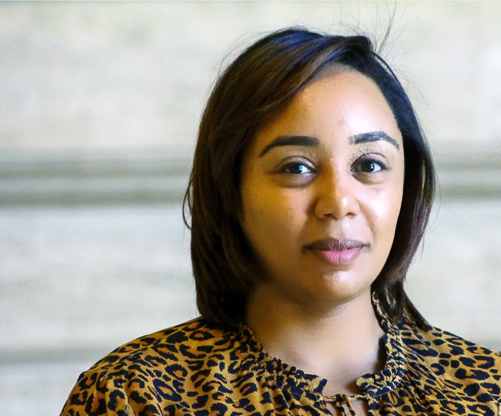

[Home](./)      /       [Meet The Team](./team.html)        /       [Archive](./archive.html)

### Meet The Team

## Nathan Raymon
Lorem ipsum dolor sit amet, consectetur adipiscing elit, sed do eiusmod tempor incididunt ut labore et dolore magna aliqua. Ut enim ad minim veniam, quis nostrud exercitation ullamco laboris nisi ut aliquip ex ea commodo consequat.

## April James
Lorem ipsum dolor sit amet, consectetur adipiscing elit, sed do eiusmod tempor incididunt ut labore et dolore magna aliqua. Ut enim ad minim veniam, quis nostrud exercitation ullamco laboris nisi ut aliquip ex ea commodo consequat.

## Jacob Lagmay
Lorem ipsum dolor sit amet, consectetur adipiscing elit, sed do eiusmod tempor incididunt ut labore et dolore magna aliqua. Ut enim ad minim veniam, quis nostrud exercitation ullamco laboris nisi ut aliquip ex ea commodo consequat.

## Lindy Voss
Lorem ipsum dolor sit amet, consectetur adipiscing elit, sed do eiusmod tempor incididunt ut labore et dolore magna aliqua. Ut enim ad minim veniam, quis nostrud exercitation ullamco laboris nisi ut aliquip ex ea commodo consequat.

## Garrett Whitehurst
Lorem ipsum dolor sit amet, consectetur adipiscing elit, sed do eiusmod tempor incididunt ut labore et dolore magna aliqua. Ut enim ad minim veniam, quis nostrud exercitation ullamco laboris nisi ut aliquip ex ea commodo consequat.

## Fatima Taha- Project Partner

Fatima Taha is originally from the Republic of the Sudan. Taha is a civil engineer by training and had been trained on international water negotiations at the Centre for Water Law, Policy and Science at the University of Dundee in Scotland. As a distinguished alumna, Taha returned to her alma mater with recruiting and marketing the Joint Program in Water Cooperation and Diplomacy between Oregon State University (OSU), IHE Delft Institute for Water Education in the Netherlands, and the University for Peace in Costa Rica. Taha is currently pursuing a dual-degree program combining a Ph.D. in Geography with an MBA in Innovation Management at OSU. Her dissertation research focuses on understanding the human perception of bioswales using serious gaming.

[back](./)